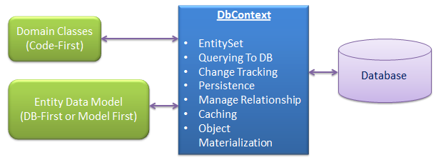
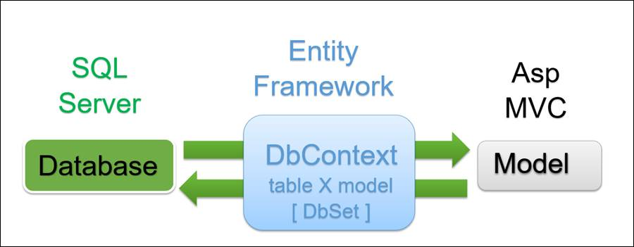

# Database Context 

DbContext is a class provided by Entity Framework to establish connection to database, query the db and close connection.
Extending DbContext permits to define database model with DbSet (specific Set mapped to a table or more), create a database, query a database...

DbContext in Entityframework works like DAL (Data Access Layer) establish connection with your database.

## DbContext Basic 


DbContext can be thought as the database connection and a set of tables, and DbSet as a representation of the tables themselves. The DbContext allows you to link your model properties (presumably using the Entity Framework) to your database with a connection string.

## DBContext as Application Layer 


Later, when you wish to refer to a database in your controller to handle data, you reference the DbContext. For Example,
```
public class UserSitesContext : DbContext
{
    public UserSitesContext()
        :base("name=UserSitesContext")
    {
    }

    public virtual DbSet<Site> Sites { get; set; }
}
```
is referenced later in the controller like
> private UserSitesContext dbUser = new UserSitesContext();

> var queryExample = from u in dbUser.Sites select u;
 :base("connection") refers to your connection string found in Web.config.

This is the base class responsible for managing database connections and provides all sorts of DB related functionality like data access methods to interact with Database.


## DB Context in ASP.NET MVC 




