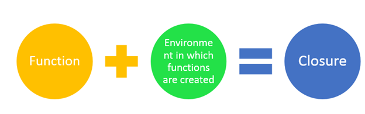

# Demystify Closure

A Function that uses one or more free variables is known as Closure

A closure is a function that remembers its outer variables and can access them. In some languages, that’s not possible, or a function should be written in a special way to make it happen. But as explained above, in JavaScript, all functions are naturally closures (there is only one exception, to be covered in The "new Function" syntax).

That is: they automatically remember where they were created using a hidden [[Environment]] property, and then their code can access outer variables.

- https://javascript.info/closure

A closure is a technique for implementing lexically scoped name binding in a language with first-class functions.

Operationally, a closure is a *record storing a function* together with *an environment*. The environment is a mapping associating each free variable of the function (variables that are used locally, but defined in an enclosing scope) with the value or reference to which the name was bound when the closure was created.

Unlike a plain function, a closure allows the function to access those captured variables through the closure's copies of their values or references, even when the function is invoked outside their scope.



A closure is an anonymous function that can access variables imported from the outside scope without using any global variables. Theoretically, a closure is a function with some arguments closed (e.g. fixed) by the environment when it is defined. Closures can work around variable scope restrictions in a clean way.


## Implementations
#### JS context
```
function html_tag(tag){
  function wrap_text(msg) {
    console.log('<'+tag+ '>'+msg+'</'+tag+'>');
  }
  return wrap_text;
}

print_h1 = html_tag('h1');
print_h1('Test Headline');
print_h1('Another Headline');

print_h1 = html_tag('p');
print_h1('Test Paragraph');
```
#### Python context
```
# Example-2
def outer_func(msg):
    message = msg

    def inner_func():
        print(message)
    return inner_func

hi_func = outer_func('Hi')
hello_func = outer_func('Hello')
hi_func()
hello_func()
```
#### PHP context
```
<?php

function criteria_greater_than($min)
{
    return function($item) use ($min) {
        return $item > $min;
    };
}

$input = [1, 2, 3, 4, 5, 6];

// Use array_filter on a input with a selected filter function
$output = array_filter($input, criteria_greater_than(3));

print_r($output);

```
