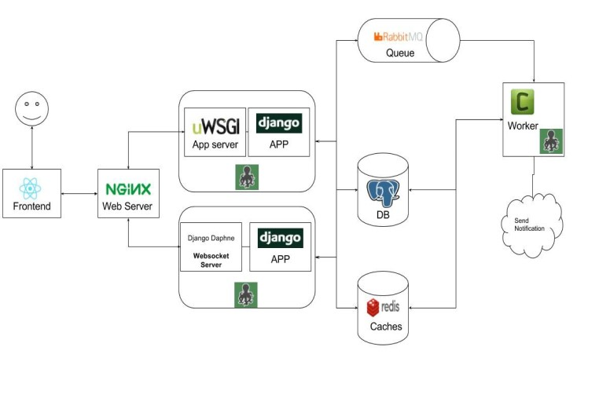
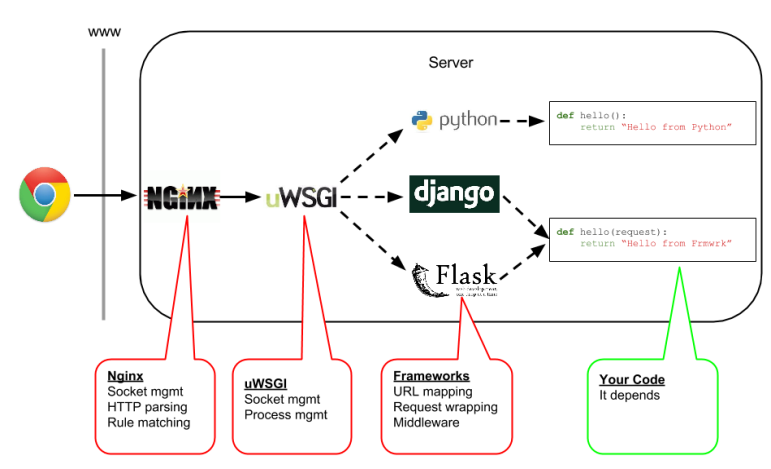

# Django Development Server
## Standard Deployment architecture 


## Django Deployment (with Reverse proxy)


## Django Server comparison 

- Django Dev
  - Pros
    - Lightweight web server comes packaged with Django

    - It serves up your static files without needing to collect them to any specific location. 
    - Has the capability to auto-restart.
   - Cons
     - It was not meant for a production environment. 
     - It is not made to handle lots of requests or load at any given time. 
- Mod_WSGI
  - Pros
    - Mod_wsgi is the most popular Python WSGI adapter module for Apache.
    - It is a highly recommended method if you are using Apache as your web server.
    - mod_wsgi are that it was built to integrate fairly seamlessly with Apache. 
  - Cons
    - mod_wsgi is that it only works with Apache. 
    - It also isn’t as light weight.
- uWSGI
  - Pros
    - uWSGI was written for Python so installation & implementation is fairly simple.
    - it is very light weight.
    - runs separately from your web server (so as not to overload your web server processes).
  - Cons
    - overhead of having to set up another server apart from your web server.
    - Needing to proxy from your main web server to uWSGI.
- Gunicorn
  - Pros
    - Gunicorn is a Python WSGI HTTP server much like uWSGI.
    - it’s simple setup and easy integration with Django.
    - Easier to proxing to main web server.
    - it is very light weight.
  - Cons 
    - overhead of having to set up another server apart from your web server.
    - Needing to proxy from your main web server to uWSGI.

## Django uWSGI setup

### uWSGI master/slave process strategy
```
# Make a new directory for uWSGI (/etc/uwsgi and /etc/uwsgi/vassals)
info "[*] Making directories /etc/uwsgi and /etc/uwsgi/vassals..."
mkdir -p /etc/uwsgi/vassals

info "[*] Creating /etc/uwsgi/emperor.ini file..."
cat > /etc/uwsgi/emperor.ini <<EOL
[uwsgi]
emperor = /etc/uwsgi/vassals
logto = /var/log/uwsgi/uwsgi.log
EOL
```

### Create the configuration file for Django
```
info "[*] Creating /etc/uwsgi/vassals/project<name>.ini."
cat > /etc/uwsgi/vassals/ndash.ini <<EOL
[uwsgi]
chdir=/var/www/project<name>
module=project<name>.wsgi:application
env=DJANGO_SETTINGS_MODULE=project<name>.settings
master=True
pidfile=/tmp/project-master.pid
vacuum=True
max-requests=5000
daemonize=/var/log/uwsgi/project<name>.log
logto=/var/log/uwsgi/project<name>.log
uid=$user
gid=$user
processes=4
EOL

# Make a new directory to store uWSGI's log (i.e., create /var/log/uwsgi)
info "[*] Making directory /var/log/uwsgi..."
mkdir -p /var/log/uwsgi
chown $user:$user /var/log/uwsgi
```

### Make the systemd service for uWSGI
```
info "[*] Creating /etc/systemd/system/emperor.uwsgi.service file..."
cat > /etc/systemd/system/emperor.uwsgi.service <<EOL
[Unit]
Description=uWSGI Emperor
After=syslog.target

[Service]
ExecStart=/usr/local/bin/uwsgi --ini /etc/uwsgi/emperor.ini
RuntimeDirectory=uwsgi
Restart=always
KillSignal=SIGQUIT
Type=notify
NotifyAccess=all
User=$user
Group=$user

[Install]
WantedBy=multi-user.target
EOL
```
## Django Gunicorn setup

### Running gunicorn 
- gunicorn [OPTIONS] [WSGI_APP]
  - gunicorn myproject.wsgi
  - gunicorn --workers=2 myproject.wsgi
  - gunicorn --env DJANGO_SETTINGS_MODULE=myproject.settings myproject.wsgi

### Make the systemd service for gunicorn

```
# Path: /etc/systemd/system/gunicorn.service
[Unit]
Description=gunicorn daemon
Requires=gunicorn.socket
After=network.target

[Service]
Type=notify
# the specific user that our service will run as
User=someuser
Group=someuser
# another option for an even more restricted service is
# DynamicUser=yes
# see http://0pointer.net/blog/dynamic-users-with-systemd.html
RuntimeDirectory=gunicorn
WorkingDirectory=/home/someuser/applicationroot
ExecStart=/usr/bin/gunicorn applicationname.wsgi
ExecReload=/bin/kill -s HUP $MAINPID
KillMode=mixed
TimeoutStopSec=5
PrivateTmp=true

[Install]
WantedBy=multi-user.target


# Socket: /etc/systemd/system/gunicorn.socket:

[Unit]
Description=gunicorn socket

[Socket]
ListenStream=/run/gunicorn.sock
# Our service won't need permissions for the socket, since it
# inherits the file descriptor by socket activation
# only the nginx daemon will need access to the socket
SocketUser=www-data
# Optionally restrict the socket permissions even more.
# SocketMode=600

[Install]
WantedBy=sockets.target

```
systemctl enable --now gunicorn.socket

Ref: https://docs.gunicorn.org/en/latest/run.html

- https://www.digitalocean.com/community/tutorials/django-server-comparison-the-development-server-mod_wsgi-uwsgi-and-gunicorn
- https://uwsgi-docs.readthedocs.io/en/latest/WSGIquickstart.html
- https://uwsgi-docs.readthedocs.io/en/latest/tutorials/Django_and_nginx.html
- https://uwsgi-docs.readthedocs.io/en/latest/Apache.html
- https://www.digitalocean.com/community/tutorials/how-to-deploy-python-wsgi-applications-using-uwsgi-web-server-with-nginx
- https://www.digitalocean.com/community/tutorials/how-to-install-and-configure-django-with-postgres-nginx-and-gunicorn