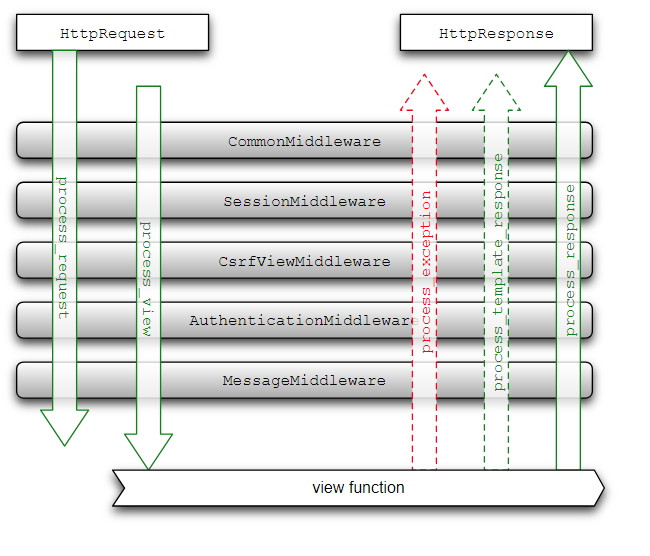

# Django Middleware

- In a nutshell, a Middleware is a regular Python class that hooks into Django’s request/response life cycle. 
- Those classes holds pieces of code that are processed upon every request/response your Django application handles.

Your Middleware class should define at least one of the following methods:

- Called during request:
  - process_request(request)
  - process_view(request, view_func, view_args, view_kwargs)
- Called during response:
  - process_exception(request, exception) (only if the view raised an exception)
  - process_template_response(request, response) (only for template responses)
  - process_response(request, response)




## Creating a Custom Middleware


Inside the `test` app I created a file named middleware.py. At the moment it looks like that:

```
class TestMiddleware(object):
  def process_exception(self, request, exception):
    if settings.DEBUG:
      print exception.__class__.__name__
      print exception.message
    return None
```

### Update middleware list in the settings
```
MIDDLEWARE_CLASSES = [
    'django.contrib.sessions.middleware.SessionMiddleware',
    'django.middleware.common.CommonMiddleware',
    'django.middleware.csrf.CsrfViewMiddleware',
    'django.contrib.auth.middleware.AuthenticationMiddleware',
    'django.contrib.auth.middleware.SessionAuthenticationMiddleware',
    'django.contrib.messages.middleware.MessageMiddleware',
    'django.middleware.clickjacking.XFrameOptionsMiddleware',
    'django.middleware.security.SecurityMiddleware',

    'test.middleware.TestMiddleware',
    ]
```
Ref : 
- https://github.com/django/django/blob/master/django/core/handlers/base.py 
- https://github.com/django/django/blob/master/django/core/handlers/exception.py
- https://simpleisbetterthancomplex.com/tutorial/2016/07/18/how-to-create-a-custom-django-middleware.html