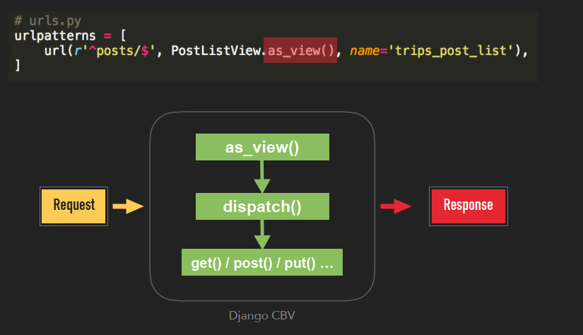

# Django View

Django offers function & class based view

## Function-based View
- A Django views is a function that :
- Take an HTTP request as the input
- Turn it into a HTTP response
- a.k.a Function-based Views (FBVs)

## View Functions

```
# urls.py
urlpatterns = [
    path('', post_list, name='posts-home'),
    path('post/<int:pk>/', post_details, name='post-detail'),
]

# views.py
def post_list(request):
  posts = Post.objects.all()
  return render(request, 'blog/post_list.html', {'posts': posts})

def post_details(request):
  post = get_object_or_404(Post, pk=pk)
  return render(request, 'blog/post_detail.html', {'post': post})

def post_add_form(request):
  if request.method=="POST":
    form=PostForm(request.POST)

    if form.is_valid():
      form.save()
      return redirect('posts-home')
  else:
    form=PostForm()

  action=reverse('post_add_form')
  return render(request,
            'blog/post_form.html',
            {'form': form, 'action': action})

```


## Class-based View

- Django views based on class
- Actually called as Function
- Using mixins to add functionality

## Some Advantages of Using Class Based View
- Code reuseability - In CBV, a view class can be inherited by another view class and modified for a different use case.
- DRY - Using CBVs help to reduce code duplication
- Code extendability - CBV can be extended to include more functionalities using Mixins
- Code structuring - In CBVs A class based view helps you respond to different http request with different class instance methods instead of conditional branching statements inside a single function based view.

## Notes 
- Django class based view provides a class instance method as_view() which serves as an entry point for any generic CBV. 
- Django URL resolver expects to send the request passed through it to a callable(a function). 
- The as_view() class instance method in each generic view creates a hook for calling the class just like a method.

As such, the url configuration for calling a CBV follows the pattern below.

```
urlpatterns = [
	url(r'^homepage/', ClassView.as_view(), name = "url_name") 
]
```
The as_view() method then calls the dispatch() method which in turn calls the class instance method defined for the applicable http request method if available or throws an HttpResponseNotAllowed exception.

```
CBV.as_view() ------> CBV.dispatch() --------------------
                                     |     |     |      | and so on.
                                     v     v     v      v
                                    get   post  head   put
```
Base class attributes can be overriden in child class as with the standard Python approach. Alternatively, the new attribute can be passed as an argument to the as_view() method of the CBV


## What does it look like?

```
# urls.py
urlpatterns = [
    path('', PostListView.as_view(), name='posts-home'),
]

# views.py

class PostListView(View):
  def get(self, request):
      posts=Post.objects.all()
      return render(request, 'blog/post_list.html',
                          {'posts': posts})

```




## What is Mixin in Python?
- Actually, mixins are ordinary Python classes
- Provides functionality to be inherited
- But isn’t meant to be instantiated on its own

```
class MyOwnMixin(object):
  def test_method1(self):
    ....
  def test_method2(self):
    ....
```
## Why mixin

- Adding functionality to classes
- Improve modularity

## When to use?
- Reuse code / features across multiple classes


## Rule of thumb
- Base view classes provided by Django always go to the
right.
- Mixins go to the left of the base view.
- Mixins should inherit from Python’s built-in object type
- Keep shallow inheritance chain
- Mixins should inherit from Python’s built-in object type

## Notes about Mixin
- Base view classes provided by Django always go to the right
- Mixins go to the left of the base view

```
class TemplateView(TemplateResponseMixin, ContextMixin, View):

  """
  A view that renders a template. this view will also pass into the context any keyword arguments passed by the URLconf
  """

  def get(self, request, *args, **kwargs):
    context=self.get_context_data(**kwargs)
    return self.render_to_response(context)

```
## Built-in Class-based Generic Views

### Category of Built-in Class-based Generic Views

- Base Generic Views
  - django.views.generic.View
  - django.views.generic.TemplateView
  - django.views.generic.RedirectView

- List Generic Views
  - django.views.generic.list.ListView
- Detail Generic Views
  - django.views.generic.detail.DetailView
- Edit Generic Views
  - django.views.generic.FormView
  - django.views.generic.CreateView
  - django.views.generic.UpdateView
  - django.views.generic.DeleteView

## Usage of Class-based View

## Template View

```
# FBV-style
def about(request):
  return render(request, 'about.html')

# CBV-style
class AboutView(TemplateView):
  template_name='about.html'
```

## ListView

```
# FBV-style
def post_list(request):
  posts=Post.objects.all()
  return render(request, 'blog/post_list.html', {'posts': posts})

# CBV-style
class PostListView(View):
  def get(self, request):
    posts=Post.objects.all()
    return render(request, 'blog/post_list.html', {'posts': posts})

```
## CreateView

```
# FBV-style
def post_add_form(request):
  if request.method=="POST":
    form=PostForm(request.POST)

    if form.is_valid():
      form.save()
      return redirect('posts-home')
  else:
    form=PostForm()
  return render(request,
            'blog/post_form.html',
            {'form': form})
# CBV-style
class PostCreateView(CreateView):
  model=Post
  form_class=PostForm
  sucess_url=reverse_lazy('blog-home')

```
## TemplateView


## ListView


## DetailView


## FormView


## The Dark Side of Mixins
- Easy to lose track of the origin of your methods
- You may actually polluting the class namespace

## The Dark Side of Generic CBVs
- Flow control is totally hidden
  - The order of execution may not be obvious to anyone else
- More difficult to debug
- To understand what’s going on. You have to read the API
docs, or even the source code of CBVs …
- Remember? “Explicit is better than implicit

## Guidelines
- Keep your view simple
- Never repeat code in your views
- Only handle presentation logic in views
- Keep your mixins simpler
- Don’t use CBVs to write 403, 404… error handlers. Use
FBVs instead
