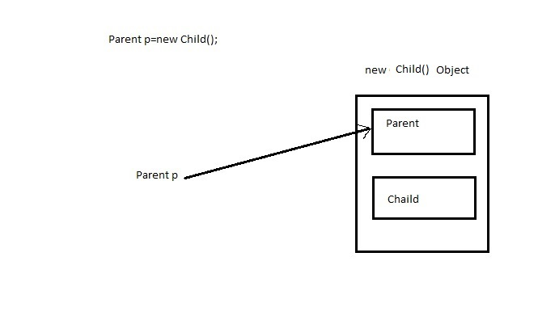
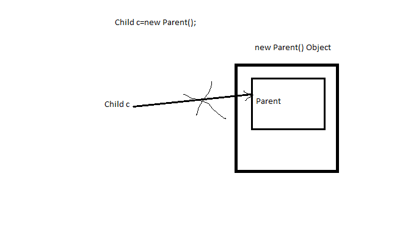

# Java 
## Inheritance 
 - Parent Class reference can point to derived class object
 - Interface reference can point to derived class object 

> Ref : https://stackoverflow.com/questions/15392832/why-parent-class-type-reference-variable-having-reference-to-child-class-object