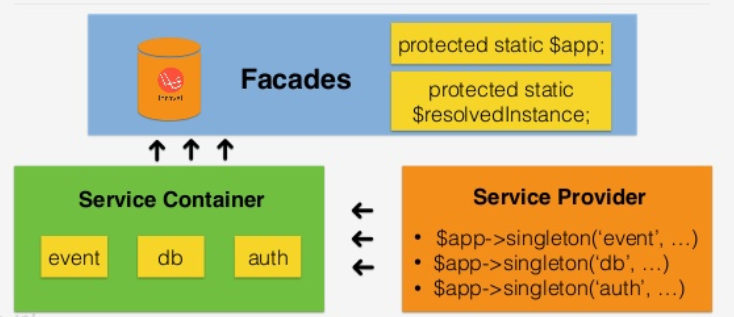

our# Laravel Facades

Facades provide a "static" interface to classes that are available in the application's service container. Laravel ships with many facades which provide access to almost all of Laravel’s features.

All of Laravel’s facades are defined in the **Illuminate/Support/Facade** namespace. So, we can easily access a facade like this:



Let's look at a simple example.
```
use Illuminate\Support\Facades\Cache;
Route::get('/cache', function () {
    return Cache::get('key');
});
```

## When to use Facades

Facades have more advantage.
- They provide a brief, memorable syntax that allows to use Laravel features without memorizing long class names that must be injected or configured manually.
- Because of their unique usage of PHP's dynamic methods, they are easy to test.
- The primary danger of facades is class scope creep. Since facades are so easy to use and do not require injection, it can be easy to let wer classes continue to grow and use many facades in a single class.

When building a third party package that interacts with laravel, it's better to inject Laravel contracts instead of using facades. Since packages are built outside of Laravel itself, you will not have access to Laravel's facade testing helper.

## Facades Vs. Dependency Injection

One of the primary benefits of dependency injection is the ability to swap implementations of the injected class. This is useful during testing since you can inject a mock or stub and assert that various methods were called on the stub.

Typically, it would not be possible to mock or stub a truly static class method. However, since facades use dynamic methods to proxy method calls to objects resolved from the service container, we actually can test facades just as we would test an injected class instance.

Let's look at a simple example.
```
use Illuminate\Support\Facades\Cache;

Route::get('/cache', function () {
    return Cache::get('key');
});
```

We can write the following test to verify that the **cache::get** method was called with the argument.

Let's look at a simple example.
```
use Illuminate\Support\Facades\Cache;

public function testBasicExample()
{
    Cache::shouldReceive('get')
         ->with('key')
         ->andReturn('value');

    $this->visit('/cache')
         ->see('value');
}
```

## Facades Vs. Helper Functions

Laravel includes a variety of "helper" functions which can perform common tasks like generating views, firing events, dispatching jobs, or sending HTTP responses. Many of these helper functions perform the same function as a corresponding facade.

> return View::make('profile');

> return view('profile');

There is no difference between facades and helper function. When using helper functions, you may still test them exactly as you want to corresponding facades.
```
Route::get('/cache', function () {
    return cache('key');
});
```
The cache helper is going to call the get method on the class underlying the cache facades. So, even though we are using the helper function, we can write the following test to verify that the method was called with the argument we expected:

Let's look at a simple example.
```
use Illuminate\Support\Facades\Cache;

public function testBasicExample()
{
    Cache::shouldReceive('get')
         ->with('key')
         ->andReturn('value');

    $this->visit('/cache')
         ->see('value');
}
```
## How Facades Work

A facade is a class that provides access to an object from the container. The machinery that makes this work is in the facade class. Laravel's facades, and any custom facades you create, will extend the base Illuminate/Support/Facades/Facade class.

The Facade base class make use of the __callStatic() magic-method to defer calls from your facade to an object resolved from the container.

Let's look at a simple example.
```
namespace App\Http\Controllers;

use App\Http\Controllers\Controller;
use Illuminate\Support\Facades\Cache;

class UserController extends Controller
{

    public function showProfile($id)
    {
        $user = Cache::get('user:'.$id);

        return view('profile', ['user' => $user]);
    }
}
```
Notice that near the top of the file we are "importing" the cache facade. This facade serves as a proxy to accessing the underlying implementation of the Illuminate/Contracts/Cache/Factory interface. Any calls we make using the facade will be passed to the underlying instance of Laravel's cache service.

Let's look at a simple example.
```
class Cache extends Facade
{

    protected static function getFacadeAccessor() { return 'cache'; }
}
```
Instead, the cache facade extends the base facade class and defines the method getFacadeAccessor(). This method's job is to return the name of a service container binding.
