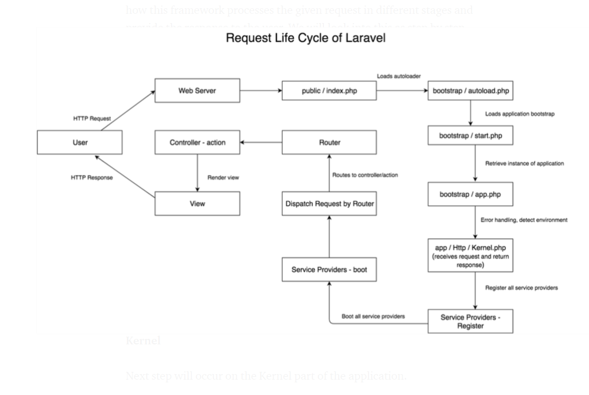

## Laravel

## Laravel lifecycle

### Laravel application load (data flow)

## What makes Laravel slow
- A large amount of files are required
- Each file needs its parsing and compiling
- Compiled results will be destroyed after request
- The default session driver of Laravel is file
- Laravel is a full-stck framework
- All the resource cannot be reused

## Scope of optimization

