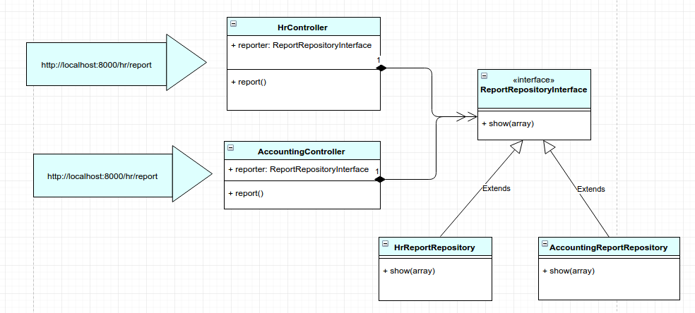

# Contextual binding in laravel and SOLID principles

Let's we need to generate 2 types of report: hr report and accounting report.

In **routes.php**, we added this line

>Route::get('report/{type}', 'ReportController@report');

type can be: *hr or accounting*

and the ReportController controller file, in this file based on type of $type variable, we will call the correspond function.
```
namespace App\Http\Controllers;

use App\Repositories\ReportRepository;

class ReportController extends Controller
{
    public function report($type) {
        $reporter = new ReportRepository;

        if($type === 'hr') {
            return $reporter->hrReport($data = []);
        }

        if($type === 'accounting') {
            return $reporter->accountingReport($data = []);
        }

        throw new \Exception('there is report function for kind of ' . $type . ' report');
    }
}
```
and we simple have the ReportRepository

```
namespace App\Repositories;

class ReportRepository
{
    public function hrReport(array $data)
    {
        dd('hrReport function');
    }

    public function accountingReport(array $data)
    {
        dd('accountingReport function');
    }
}
```

now, try php artsian serve, and go to localhost:

>http://localhost:8000/report/hr

Output: hrReport function

>http://localhost:8000/report/accounting

Output: accountingReport function

The idea for this simple solution is that:

In ReportController.php, I injected ReportRepository class into
For each type of report (report/accounting or report/hr), the instance $report (type of ReportRepository) will call correspond function with the type of report.

The problem with this way is that it violated Open for extension and close for modification (O) rule in SOLID principle. For e.g: In case, you have another type of report, you must go to the controller and add more if condition, and add more code for the new report type in ReportRepository as well.

By following the O in SOLID principle, you can reduce if condition, separating the of concern of type of report into another class (in this case, I used laravel fw – so the class file is ApplicationServiceProvider), decoupling code dependency and easy for testing (mocking the interface is alway easy).

So, let’s implement new way that follow O in SOLID principle.

The idea for this way is:
- For each type of report, there will be an implementation of function show of ReportRepositoryInteface interface.
- Injecting ReportRepositoryInteface into each controller for each type of report
- Binding based context ( type of report) in AppServiceProvider class

I hope it much easier for you to understand the second implementation with this diagram



First, we need ReportRepositoryInterface.php file
```
namespace App\Repositories;

interface ReportRepositoryInterface
{
    public function show(array $data);
}
```
then, AccountingReportRepository.php
```
namespace App\Repositories;

class AccountingReportRepository implements ReportRepositoryInterface
{
    public function show(array $data)
    {
        dd(get_class($this));
    }
}
```

and HrReportRepository.php
```
namespace App\Repositories;

class HrReportRepository implements ReportRepositoryInterface
{
    public function show(array $data)
    {
        dd(get_class($this));
    }
}
```

Then, how to make those code work in laravel framework, laravel >5 support contextual binding

adding 2 lines into the **routes.php** file
>Route::get('accounting/report', 'AccountingController@report');<br>
>Route::get('hr/report', 'HrController@report');

It is more reasonable to consider report is an action in AccountingController or HrController

### AccountingController.php

```
namespace App\Http\Controllers;

use App\Repositories\ReportRepositoryInterface;

class AccountingController extends Controller
{
    /**
     * @var ReportRepositoryInterface
     */
    protected $report;

    public function __construct(ReportRepositoryInterface $report)
    {
        $this->report = $report;
    }

    public function report()
    {
        $this->report->show($data = []);
    }
}
```

### HrController.php
```
namespace App\Http\Controllers;

use App\Repositories\ReportRepositoryInterface;

class HrController extends Controller
{
    /**
     * @var ReportRepositoryInterface
     */
    protected $report;

    public function __construct(ReportRepositoryInterface $report)
    {
        $this->report = $report;
    }

    public function report()
    {
        $this->report->show($data = []);
    }
}
```

Then, we just need to bind the concrete class to interface just in contextual. The logic is as it is:
- when AccountingController need ReportRepositoryInterface give it AccountReportRepository
- when HrController need ReportRepositoryInterface give it HrReportRepository

and, just need to add the code in register function of AppServiceProvider (SC)
```
namespace App\Providers;

use Illuminate\Support\ServiceProvider;

class AppServiceProvider extends ServiceProvider
{
    /**
     * Bootstrap any application services.
     *
     * @return void
     */
    public function boot()
    {
        //
    }

    /**
     * Register any application services.
     *
     * @return void
     */
    public function register()
    {
        $this->app->when('App\Http\Controllers\AccountingController')
                  ->needs('App\Repositories\ReportRepositoryInterface')
                  ->give('App\Repositories\AccountingReportRepository');

        $this->app->when('App\Http\Controllers\HrController')
                  ->needs('App\Repositories\ReportRepositoryInterface')
                  ->give('App\Repositories\HrReportRepository');
    }
}
```
