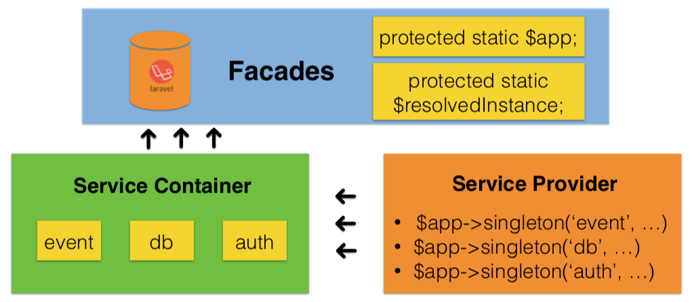
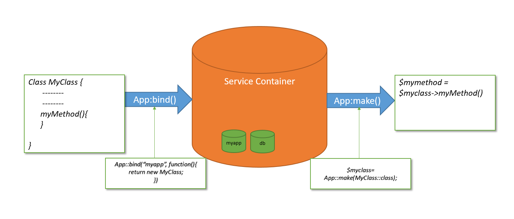
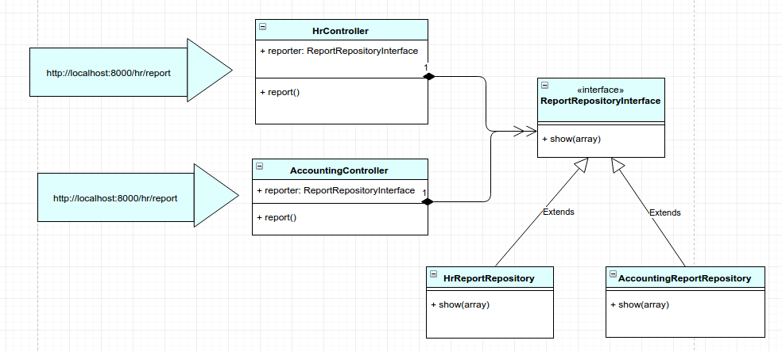

# Demystify Service Container & IoC
## Service Container

A modern PHP application is full of objects. Several objects are responsible for various purposes. One object may facilitate the delivery of email messages while another may allow us to persist information into a database. In our application, we may create an object that manages our product inventory, or another object that processes data from a third-party API. The point is that a modern application does many things and is organized into many objects that handle each task.

A special core object of any modern PHP called a **service container** will help us in the following aspects
  - standardize &
  - centralize the way objects are constructed in application.
  - the container makes life easier as it is super fast, and
  - emphasizes an architecture that promotes reusable and decoupled code.

## What is Service

Put simply, a Service is any PHP object that performs some sort of "global" task. It's a purposefully-generic name used in computer science to describe an object that's created for a specific purpose (e.g. delivering emails). Each service is used throughout our application whenever we need the specific functionality it provides. We don't have to do anything special to make a service: simply write a PHP class with some code that accomplishes a specific task. Congratulations, we've just created a service!

So what's the big deal then? The advantage of thinking about "services" is that we begin to think about separating each piece of functionality in our application into a series of services. Since each service does just one job, we can easily access each service and use its functionality wherever we need it. Each service can also be more easily tested and configured since it's separated from the other functionality in our application. This idea is called service-oriented architecture and is not unique to Laravel or even PHP. Structuring our application around a set of independent service classes is a well-known and trusted object-oriented best-practice. These skills are key to being a good developer in almost any language.

> As a rule, a PHP object is a service if it is used globally in your application. A single Mailer service is used globally to send email messages whereas the many Message objects that it delivers are not services. Similarly, a Product object is not a service, but an object that persists Product objects to a database is a service.


## Laravel Service Container
The Laravel service container is a powerful tool for managing class dependencies and performing dependency injection. Dependency injection is a fancy phrase that essentially means this: class dependencies are “injected” into the class via the constructor or, in some cases, “setter” methods.

Simply put, the service container is a container that holds classes you’d like to resolve(instantiate) programmatically later in your application.



Laravel's service container located in
>vendor/laravel/framwork/src/Illuminate/Container/Container.php

We define how an object should be created in one point of the application (the binding) and every time we need to create a new instance, we just ask it to the service container, and it will create it for you, along with the required dependencies

For example, instead of creating objects manually with the new keyword with class dependencies, we can bind ***ourClas or, ourInterface***:

>$instance = new OurClass($dependency);

We can rather register a binding on the Service Container:

```
//add a binding for the class YourClass
App::bind( OurClass::class, function()
{
    //do some preliminary work: create the needed dependencies
    $dependency = new DepClass( config('some.value') );

    //create and return the object with his dependencies
    return new OurClass( $dependency );
});
```
and create an instance through the service container (SC) with the following way. No need to create the OurClass dependencies, the SC will do that for us!
> $instance = App::make( OurClass::class );

The following snippet illustrates the above steps:




With Laravel automatic dependency injection, when an interface is required in some part of the app (i.e. in a controller's constructor), a concrete class is instantiated automatically by the Service Container. Changing the concrete class on the binding, will change the concrete objects instantiated through all our app:

Here, every time a ***UserRepositoryInterface*** is requested, create an ***EloquentUserRepository***
>App::bind( UserRepositoryInterface::class, EloquentUserRepository::class );


**Using the Service Container as a Registry**

You can create and store unique object instances on the container and get them back later: using the App::instance method to make the binding, and thus using the container as a Registry.
```
// Create an instance.
$kevin = new User('Kevin');

// Bind it to the service container.
App::instance('the-user', $kevin);

// ...somewhere and/or in another class...

// Get back the instance
$kevin = App::make('the-user');
```
As a final note, essentially the Service Container -is- the Application object: it extends the Container class, getting all the container's functionalities.


## Binding
### Binding Basics

**Almost all of our service container bindings will be registered within service providers**, so most of these examples will demonstrate using the container in that context. **Binding take place in the register method of ServiceProvider**

> There is no need to bind classes into the container if they do not depend on any interfaces. The container does not need to be instructed on how to build these objects, since it can automatically resolve these objects using reflection.

#### Simple Bindings
Within a service provider, you always have access to the container via the **$this->app** property. We can register a binding using the bind method, passing the class or interface name that we wish to register along with a Closure that returns an instance of the class:

```
$this->app->bind('HelpSpot\API', function ($app) {
    return new HelpSpot\API($app->make('HttpClient'));
});
```

Note that we receive the container itself as an argument to the resolver. We can then use the container to resolve sub-dependencies of the object we are building.

#### Binding A Singleton

The singleton method binds a class or interface into the container that should only be resolved one time. Once a singleton binding is resolved, the same object instance will be returned on subsequent calls into the container:
```
$this->app->singleton('HelpSpot\API', function ($app) {
    return new HelpSpot\API($app->make('HttpClient'));
});
```
#### Binding Instances

You may also bind an existing object instance into the container using the instance method. The given instance will always be returned on subsequent calls into the container:
```
$api = new HelpSpot\API(new HttpClient);

$this->app->instance('HelpSpot\API', $api);
```
#### Binding Primitives

Sometimes you may have a class that receives some injected classes, but also needs an injected primitive value such as an integer. You may easily use contextual binding to inject any value your class may need:
```
$this->app->when('App\Http\Controllers\UserController')
           ->needs('$variableName')
           ->give($value);
```
### Binding Interfaces To Implementations

A very powerful feature of the service container is its ability to bind an interface to a given implementation. For example, let's assume we have an EventPusher interface and a RedisEventPusher implementation. Once we have coded our RedisEventPusher implementation of this interface, we can register it with the service container like so:
```
$this->app->bind(
    'App\Contracts\EventPusher',
    'App\Services\RedisEventPusher'
);
```
This statement tells the container that it should inject the RedisEventPusher when a class needs an implementation of EventPusher. Now we can type-hint the EventPusher interface in a constructor, or any other location where dependencies are injected by the service container:
```
use App\Contracts\EventPusher;

/**
 * Create a new class instance.
 *
 * @param  EventPusher  $pusher
 * @return void
 */
public function __construct(EventPusher $pusher)
{
    $this->pusher = $pusher;
}
```
### Contextual Binding

Sometimes you may have two classes that utilize the same interface, but you wish to inject different implementations into each class. For example, two controllers may depend on different implementations of the same **ReportRepositoryInterface**:


```
namespace App\Providers;

use Illuminate\Support\ServiceProvider;

class AppServiceProvider extends ServiceProvider
{
    /**
     * Bootstrap any application services.
     *
     * @return void
     */
    public function boot()
    {
        //
    }

    /**
     * Register any application services.
     *
     * @return void
     */
    public function register()
    {
        $this->app->when('App\Http\Controllers\AccountingController')
                  ->needs('App\Repositories\ReportRepositoryInterface')
                  ->give('App\Repositories\AccountingReportRepository');

        $this->app->when('App\Http\Controllers\HrController')
                  ->needs('App\Repositories\ReportRepositoryInterface')
                  ->give('App\Repositories\HrReportRepository');
    }
}
```
### Tagging

Occasionally, you may need to resolve all of a certain "category" of binding. For example, perhaps you are building a report aggregator that receives an array of many different Report interface implementations. After registering the Report implementations, you can assign them a tag using the tag method:
```
$this->app->bind('SpeedReport', function () {
    //
});

$this->app->bind('MemoryReport', function () {
    //
});

$this->app->tag(['SpeedReport', 'MemoryReport'], 'reports');
```
Once the services have been tagged, you may easily resolve them all via the tagged method:
```
$this->app->bind('ReportAggregator', function ($app) {
    return new ReportAggregator($app->tagged('reports'));
})
```
### Extending Bindings

The extend method allows the modification of resolved services. For example, when a service is resolved, you may run additional code to decorate or configure the service. The extend method accepts a Closure, which should return the modified service, as its only argument:
```
$this->app->extend(Service::class, function ($service) {
    return new DecoratedService($service);
});
```
### Resolving

**The make Method**

You may use the make method to resolve a class instance out of the container. The make method accepts the name of the class or interface you wish to resolve:

>$api = $this->app->make('HelpSpot\API');

If you are in a location of your code that does not have access to the $app variable, you may use the global resolve helper:

>$api = resolve('HelpSpot\API');

If some of your class' dependencies are not resolvable via the container, you may inject them by passing them as an associative array into the makeWith method:

>$api = $this->app->makeWith('HelpSpot\API', ['id' => 1]);

## Simulate a container class

 ```
 class SimpleContainer
 {
    protected static $container = [];

    public static function bind($name, Callable $resolver)
    {
        static::$container[$name] = $resolver;
    }

    public static function make($name)
    {
      if(isset(static::$container[$name])){
        $resolver = static::$container[$name] ;
        return $resolver();
    }
    throw new Exception("Binding does not exist in containeer");
  }
}
 ```

Here I will try to show that how simple container resolves dependency

```
class LogToDatabase
{
    public function execute($message)
    {
       var_dump('log the message to a database :'.$message);
    }
}
class UsersController {

    protected $logger;

    public function __construct(LogToDatabase $logger)
    {
        $this->logger = $logger;
    }

    public function show()
    {
      $user = 'JohnDoe';
      $this->logger->execute($user);
    }
}
```
Here bind dependency.
```
SimpleContainer::bind('Foo', function()
 {
   return new UsersController(new LogToDatabase);
 });

 $foo = SimpleContainer::make('Foo');
 print_r($foo->show());
```
Output:
> string(36) "Log the messages to a file : JohnDoe"
