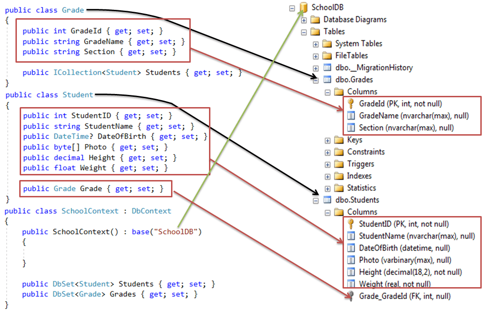

# Entity Framework 6

# EF Code pathway 

- Create Domain Class/Model
- Create Context Class (Database abstraction of EF6)
- Consume context class for DB operation 


```
public class Student
{
    public int ID { get; set; }
    public string FirstName { get; set; }
    public string LastName { get; set; }

    public DateTime EnrollmentDate { get; set; }
        
    public virtual ICollection<Enrollment> Enrollments { get; set; }
}


public enum Grade
    {
        A, B, C, D, F
    }

public class Enrollment
{
    public int EnrollmentID { get; set; }
    public int CourseID { get; set; }
    public int StudentID { get; set; }
    public Grade? Grade { get; set; }

    public virtual Course Course { get; set; }
    public virtual Student Student { get; set; }
}


public class SampleContext: DbContext 
{
    public SampleContext(): base()
    {
        
    }
        
    public DbSet<Student> Students { get; set; }
    public DbSet<Grade> Enrollments { get; set; }
}


class Program
    {
        static void Main(string[] args)
        {
     
            using (var ctx = new SampleContext())
            {
                var stud = new Student() { StudentName = "Bill" };
        
                ctx.Students.Add(stud);
                ctx.SaveChanges();                
            }
        }
    }


```

### Table in Database 


### Database & Model mapping 



## EF 6 Code-First Conventions

| Default        | Description          | 
| ------------- |:-------------:| 
|Schema	| By default, EF creates all the DB objects into the dbo schema.|
|Table Name	|```<Entity Class Name>``` + 's' EF will create a DB table with the entity class name suffixed by 's' e.g. Student domain class (entity) would map to the Students table.|
|Primary key Name|	1) Id 2) ```<Entity Class Name>``` + "Id" (case insensitive) EF will create a primary key column for the property named Id or <Entity Class Name> + "Id" (case insensitive).|
|Foreign key property Name|	By default EF will look for the foreign key property with the same name as the principal entity primary key name. If the foreign key property does not exist, then EF will create an FK column in the Db table with ```<Dependent Navigation Property Name>``` + "_" + ```<Principal Entity Primary Key Property Name>``` e.g. EF will create Grade_GradeId foreign key column in the Students table if the Student entity does not contain foreignkey property for Grade.|

## Database Initialization in EF6

The following figure shows a database initialization workflow, based on the parameter passed in the base constructor of the context class, which is derived from DbContext:


Entity Framework code-first database initialization
As per the above figure, the base constructor of the context class can have the following parameter.

- No Parameter
- Database Name
- Connection String Name

```
# No Parameter
public class Context: DbContext 
{
    public Context(): base()
    {
        
    }
}

# Database Name
public class Context: DbContext 
{
    public Context(): base("MySampleDB") 
    {
               
    }
}

# ConnectionString Name
public class Context: DbContext 
{
    public SampleDBContext() : base("name=SampleDBConnectionString") 
    {
    }
}

```
## Database Initialization Strategies in EF6

There are four different database initialization strategies:

- CreateDatabaseIfNotExists
- DropCreateDatabaseIfModelChanges
- DropCreateDatabaseAlways
- Custom DB Initializer


```
public class SampleDBContext: DbContext 
{
    public SampleDBContext(): base("SampleDBConnectionString") 
    {
        Database.SetInitializer<SampleDBContext>(new CreateDatabaseIfNotExists<SampleDBContext>());

        //Database.SetInitializer<SampleDBContext>(new DropCreateDatabaseIfModelChanges<SampleDBContext>());
        //Database.SetInitializer<SampleDBContext>(new DropCreateDatabaseAlways<SampleDBContext>());
        //Database.SetInitializer<SampleDBContext>(new SampleDBInitializer());
    }

    public DbSet<Student> Students { get; set; }
    public DbSet<Standard> Standards { get; set; }

}

You can also create your custom DB initializer, by inheriting one of the initializers, as shown below:

public class SampleDBInitializer :  CreateDatabaseIfNotExists<SampleDBContext>
{
    protected override void Seed(SampleDBContext context)
    {
        base.Seed(context);
    }
}
 
# Set the DB Initializer in the Configuration File

<?xml version="1.0" encoding="utf-8" ?>
<configuration>
    <appSettings>
    <add key="DatabaseInitializerForType SampleDataLayer.SampleDBContext, SampleDataLayer"         
        value="System.Data.Entity.DropCreateDatabaseAlways`1[[SampleDataLayer.SampleDBContext, SampleDataLayer]], EntityFramework" />
    </appSettings>
</configuration>

# You can set the custom DB initializer, as follows:

<?xml version="1.0" encoding="utf-8" ?>
<configuration>
    <appSettings>    
    <add key="DatabaseInitializerForType SampleDataLayer.SampleDBContext, SampleDataLayer"
            value="SampleDataLayer.SampleDBInitializer, SampleDataLayer" />
    </appSettings>
</configuration>
        
```
### Turn off the DB Initializer
You can turn off the database initializer for your application. 

````
public class SampleDBContext: DbContext 
{
    public SampleDBContext() : base("SampleDBConnectionString")
    {            
        //Disable initializer
        Database.SetInitializer<SampleDBContext>(null);
    }
    public DbSet<Student> Students { get; set; }
    public DbSet<Standard> Standards { get; set; }
}
        
# You can also turn off the initializer in the configuration file, for example:

<?xml version="1.0" encoding="utf-8" ?>
<configuration>
    <appSettings>    
    <add key="DatabaseInitializerForType SampleDataLayer.SampleDBContext, SampleDataLayer"
            value="Disabled" />
    </appSettings>
</configuration>

```
## Inheritance Strategy in Entity Framework 6

```
# Sample Inheritance class structure

public abstract class BillingDetail 
{
    public int BillingDetailId { get; set; }
    public string Owner { get; set; }        
    public string Number { get; set; }
}
 
public class BankAccount : BillingDetail
{
    public string BankName { get; set; }
    public string Swift { get; set; }
}
 
public class CreditCard : BillingDetail
{
    public int CardType { get; set; }                
    public string ExpiryMonth { get; set; }
    public string ExpiryYear { get; set; }
}
 

```

### Table per Hierarchy (TPH)
This approach suggests one table for the entire class inheritance hierarchy. The table includes a discriminator column which distinguishes between inheritance classes. This is a default inheritance mapping strategy in Entity Framework.
Enable polymorphism by denormalizing the SQL schema, and utilize a type discriminator column that holds type information.

```
public class InheritanceMappingContext : DbContext
{
    public DbSet<BillingDetail> BillingDetails { get; set; }
}

## Polymorphic Queries
List<BillingDetail> billingDetails = ontext.BillingDetails
                                      .select(b=> b)
                                      .ToList();

## Non-Polymorphic Queries
IQueryable<BankAccount> query = context.BillingDetails
                                .select(b=> b)
                                .OfType<BankAccount>;
```


There are three major issues exist in TPH:
- Discriminator Column
- TPH Requires Properties in SubClasses to be Nullable in the Database
- TPH Violates the Third Normal Form
- https://weblogs.asp.net/manavi/inheritance-mapping-strategies-with-entity-framework-code-first-ctp5-part-1-table-per-hierarchy-tph

### Table per Type (TPT)
This approach suggests a separate table for each domain class. Represent "is a" (inheritance) relationships as "has a" (foreign key) relationships.
- https://weblogs.asp.net/manavi/inheritance-mapping-strategies-with-entity-framework-code-first-ctp5-part-2-table-per-type-tpt 

### Table per Concrete class (TPC)
This approach suggests one table for one concrete class, but not for the abstract class. So, if you inherit the abstract class in multiple concrete classes, then the properties of the abstract class will be part of each table of the concrete class. Discard polymorphism and inheritance relationships completely from the SQL schema.


```
public class InheritanceMappingContext : DbContext
{
    public DbSet<BillingDetail> BillingDetails { get; set; }
        
    protected override void OnModelCreating(DbModelBuilder modelBuilder)
    {
        # Solving the Identity Problem in TPC
        modelBuilder.Entity<BillingDetail>()
            .Property(p => p.BillingDetailId)
            .HasDatabaseGenerationOption(DatabaseGenerationOption.None);
        
        modelBuilder.Entity<BankAccount>().Map(m =>
        {
            m.MapInheritedProperties();
            m.ToTable("BankAccounts");
        });
 
        modelBuilder.Entity<CreditCard>().Map(m =>
        {
            m.MapInheritedProperties();
            m.ToTable("CreditCards");
        });            
    }
}

# EntityMappingConfiguration class turns out to be a key type for inheritance mapping in Code First

namespace System.Data.Entity.ModelConfiguration.Configuration.Mapping
{
    public class EntityMappingConfiguration<TEntityType> where TEntityType : class
    {
        public ValueConditionConfiguration Requires(string discriminator);
        public void ToTable(string tableName);
        public void MapInheritedProperties();
    }
}

As you have seen so far, we used its Requires method to customize TPH. We also used its ToTable method to create a TPT and now we are using its MapInheritedProperties along with ToTable method to create our TPC mapping.

```


- https://weblogs.asp.net/manavi/inheritance-mapping-strategies-with-entity-framework-code-first-ctp5-part-3-table-per-concrete-type-tpc-and-choosing-strategy-guidelines