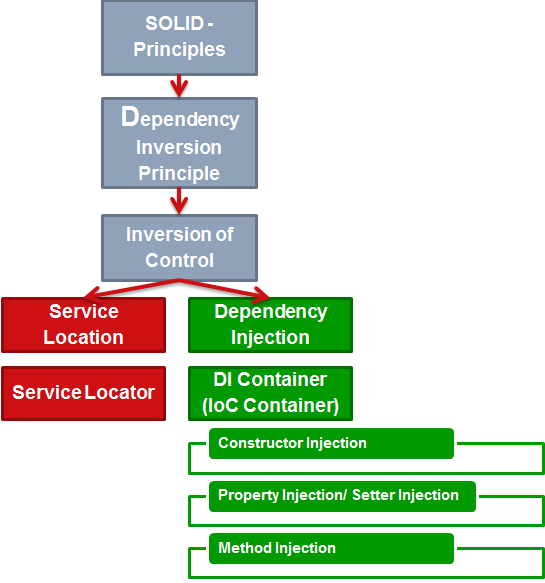
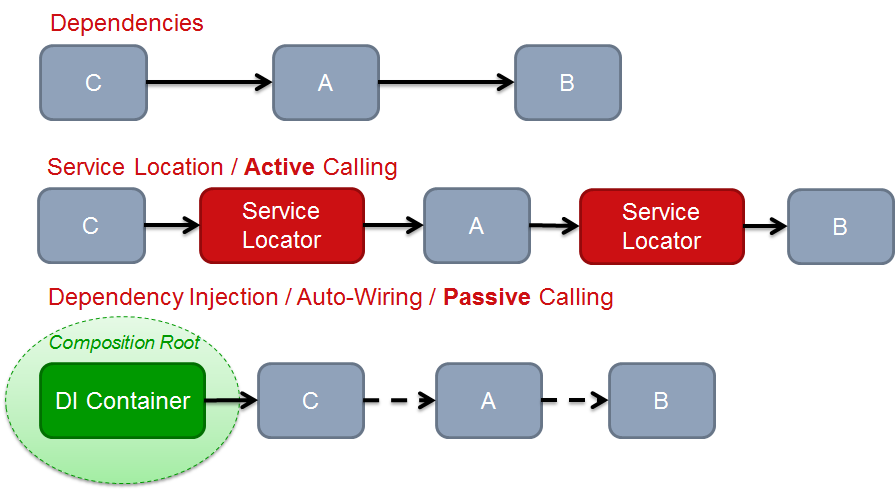

# Dependency Inversion Principle

## Why so many terms to say the same thing? IoC and DIP

  Inversion of Control is the generic term. Dependency Injection is a specific type of IoC

  Inversion of Control is when the framework/infrastructure invokes application code, rather than the other way around

  can do DI without doing IoC. If you inject aConsoleStringWriter into a HelloWorld I don't really think of this as IoC because there is no "framework" or "infrastructure".

## Inversion of Control < Dependency Injection

  If you accept Fowler's definition, Inversion of Control is a much broader term than DI that covers allframework usage where you plug into a framework, but the framework is still in control. Dependency Injection is a specialization of IoC that applies IoC specifically to manage dependencies.

## Where exactly is the difference between IoC and DI

  IoC is the ability to vary the implementation of a contract. DI is the ability to supply the implementation.

  In traditional applications, developers would write business code and framework code. The business code would then call the framework code to accomplish tasks. Under an IoC model, you "invert" that model and create a framework that accepts business modules and calls them to accomplish tasks

  Dependency Injection is a technique (hard to call it a pattern, really) of removing internal dependencies from implementations by allowing dependent objects to be injected into the class/method by an external caller. IoC frameworks use dependency injection to supply user modules and other dependent code to framework routines that "glue it all together." Dependency injection is used heavily by IoC frameworks because that is the mechanism that allows them to "Call You."

## DIP vs. DI vs. IoC

  DIP is the principle that guides us towards DI. Basically, loose coupling is the goal, and there are at least two ways to achieve it. • Dependency Injection • Service Locator

## Does anyone have a good analogy for dependency injection?

  The essence of Inversion of Control (of which Dependency Injection is an implementation) is the separation of the use of an object from the management thereof.

## Difference between ioc and dependency injection

  The terms Dependency Injection (DI) & Inversion of Control (IoC) are generally used interchangeably to describe the same design pattern (although not everyone agrees on that point, and some people tend to apply them in slightly different ways). The pattern was originally called IoC, but Martin Fowler proposed the shift to DI because all frameworks invert control in some way and he wanted to be more specific about which aspect of control was being inverted.

## Inversion of Control vs Dependency Injection

  Inversion of Control (IoC) means that objects do not create other objects on which they rely to do their work. Instead, they get the objects that they need from an outside source (for example, an xml configuration file). Dependency Injection (DI) means that this is done without the object intervention, usually by a framework component that passes constructor parameters and set properties.

DIP means that you program against an abstraction. You invert the kind of a dependency from an implementation to an abstraction.

IOC means that somebody else is responsible for getting the implementation for the given abstraction. Normally the consumer would use the new keyword to get a dependency. With IoC you invert the control, so that the consumer is not responsible for creating the instance anymore.

Dependency Injection and Service Location are a part of Inversion of Control.

> Ref: https://stackoverflow.com/questions/11316688/inversion-of-control-vs-dependency-injection-with-selected-quotes-is-my-unders/11319026#11319026
