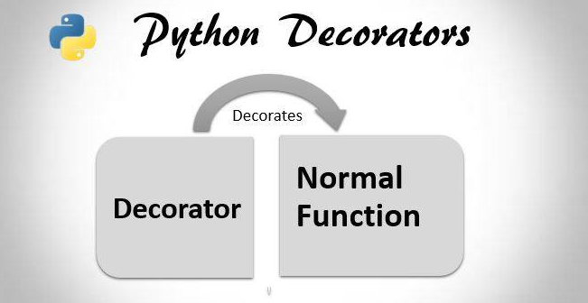

# Demystify Decorator

A decorator is a programming pattern where you wrap something in something else to change some aspect of the original’s behavior.

In Python, decorators are functions that return a version of the thing that is decorated. In Java, the decoration pattern is generally implemented in the form of wrapper classes (though Java also has a feature called “annotations” that are decorators that work kind of like Python decorators).



## Decorator implementation

```
Example-1
----------
# Here @decorator_func ---> display = decorator_func(display)

# decorator
def decorator_func(original_func):
    def wrapper_func(*args, **kargs):
        print('warpper executed this before {}'.format(original_func.__name__))
        return original_func(*args, **kargs)
    return wrapper_func

def display():
    print('display function ran')

def display_info(name, age):
    print('display info ran with arguments ({}, {})'.format(name, age))

@decorator_func
display_info('MD', 36)
@decorator_func
display()

-----------------------------------------------------------------
Example-2 (Calculate how much it takes to execute some function)
-----------------------------------------------------------------
import time

# decorator
def time_it(func):
    def wrapper(*args, **kwargs):
        start = time.time()
        result = func(*args, **kwargs)
        end = time.time()
        print(func.__name__ + ' took ' + str((end-start)*1000) + ' mil sec')
        return result
    return wrapper

# Calculate squares

@time_it
def calc_square(numbers):
    result = []
    for number in numbers:
        result.append(number*number)
    return result

# Calculate cubes
@time_it
def calc_cube(numbers):
    result = []
    for number in numbers:
        result.append(number*number*number)
    return result

array = range(1, 1000)
out_square = calc_square(array)
out_cube = calc_cube(array)


-------------------------------------------
Example-3 (To make bold & italic letters)
-------------------------------------------

from functools import wraps

def makebold(fn):
    @wraps(fn)
    def wrapped(*args, **kwargs):
        return "<b>" + fn(*args, **kwargs) + "</b>"
    return wrapped

def makeitalic(fn):
    @wraps(fn)
    def wrapped(*args, **kwargs):
        return "<i>" + fn(*args, **kwargs) + "</i>"
    return wrapped

@makebold
@makeitalic
def hello():
    return "hello world"

@makebold
@makeitalic
def log(s):
    return s

print(hello())        # returns "<b><i>hello world</i></b>"
print(hello.__name__)  # with functools.wraps() this returns "hello"
print(log('hello'))   # returns "<b><i>hello</i></b>"

```
