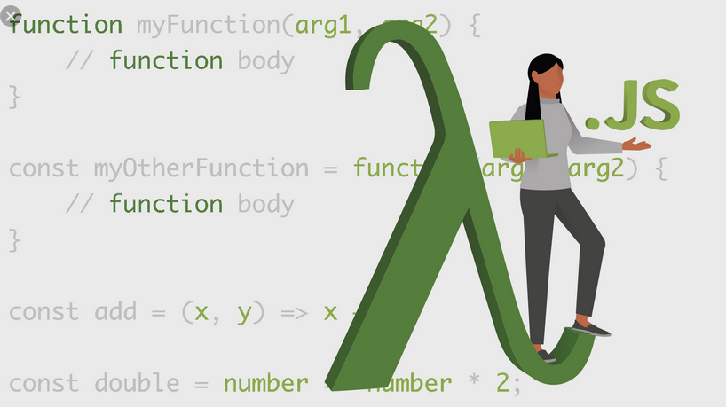

# First-class Function
A programming language is said to have First-class functions when functions in that language are treated like any other variable. For example, in such a language, a function
- can be passed as an argument to other functions,
- can be returned by another function,
- can be assigned as a value to a variable.



## Assign a function to a variable
#### JS context

```
const f = function square(x) {
   return x*x;
 };

console.log(f);
console.log(f(5));
```
#### Python context

```
def square(x):
    return x*x

f = square
print(square)
print(f)
print(f(5))
```

## Pass a function as an Argument
#### JS context
```
Example-1
---------------
function sayHello() {
   return "Hello, ";
}

function greeting(helloMessage, name) {
  console.log(helloMessage() + name);
}

// Pass `sayHello` as an argument to `greeting` function
greeting(sayHello, "JavaScript!");


Example-2
---------------
function square(x) {
  return x*x;
}

function cube(x){
    return x*x*x;
}

function my_map(func, args){
  result =[];
  for(let arg of args){
    result.push(func(arg));
  }
  return result;
}

let squares = my_map(square, [1,2,3,4,5]);
console.log(squares);

let cubes = my_map(cube, [1,2,3,4,5]);
console.log(cubes);
```
#### Python context

```
def square(x):
    return x*x

def cube(x):
    return x*x*x

def my_map(func, args):
    result = []
    for arg in args:
        result.append(func(arg))
    return result

squares = my_map(square, [1, 2, 3, 4, 5])
print(squares)

cubes = my_map(cube, [1, 2, 3, 4, 5])
print(cubes)
```
## Return a function
#### JS context
```
Example-1
---------------------
function logger(msg){
  function log_message() {
    console.log('Log: '+msg);
  }
  return log_message;
}

log_hi = logger('Hi!');
log_hi();

Example-2
--------------------
function html_tag(tag){
  function wrap_text(msg) {
    console.log('<'+tag+ '>'+msg+'</'+tag+'>');
  }
  return wrap_text;
}

print_h1 = html_tag('h1');
print_h1('Test Headline');
print_h1('Another Headline');

print_h1 = html_tag('p');
print_h1('Test Paragraph');
```
#### Python context
```
Example-1
-----------------
def logger(msg):
    def log_message():
        print('Log: ', msg)
    return log_message

log_hi = logger('Hi')
log_hi()

Example-2
----------------
def html_tag(tag):
    def wrap_text(msg):
        print('<{0}>{1}</{0}>'.format(tag, msg))
    return wrap_text

print_h1 = html_tag('h1')
print_h1('Test Headline')
print_h1('Another Headline')

print_h1 = html_tag('p')
print_h1('Test Paragraph')
```
